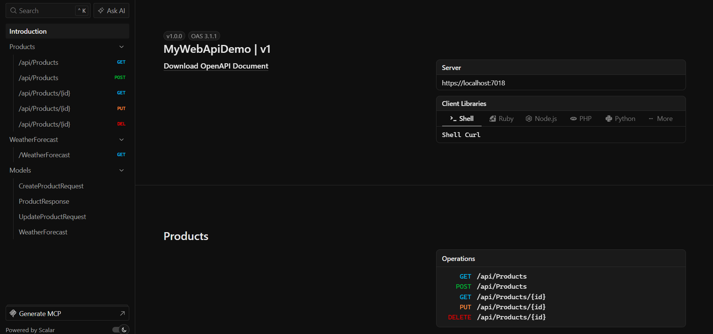
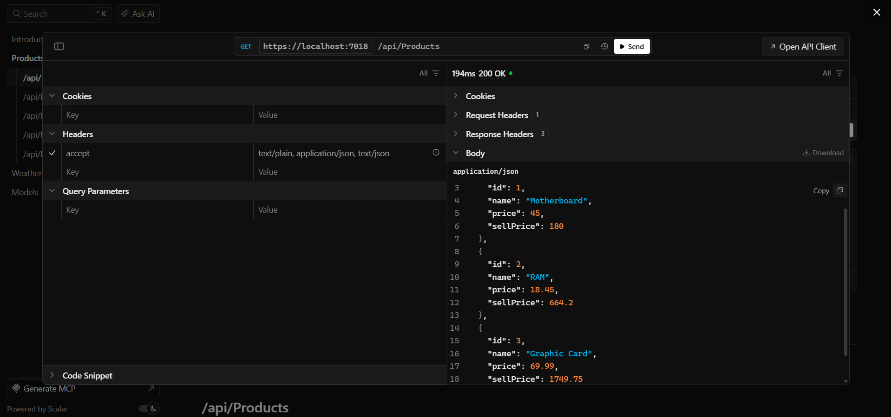
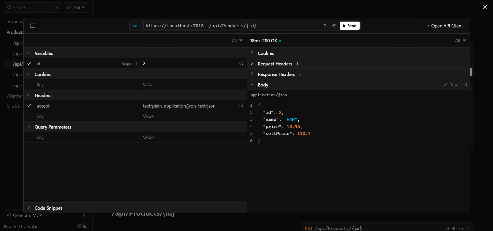
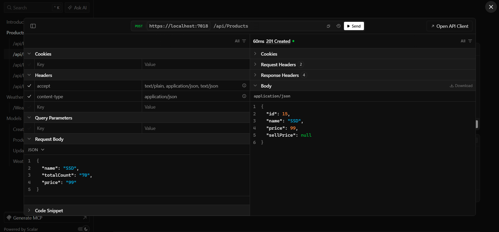
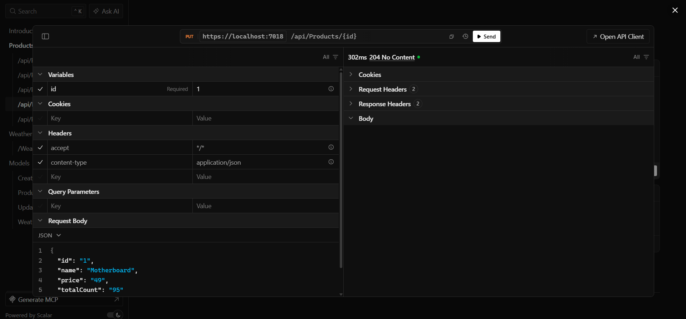
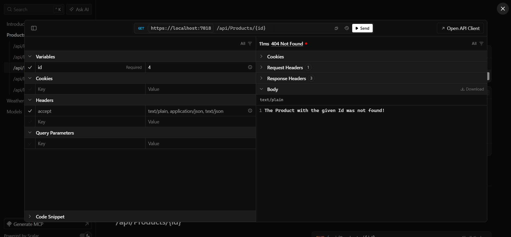

# 🏪 Products Web API - CRUD Demonstration

A clean implementation of RESTful CRUD operations using **.NET 10** and **Entity Framework Core**. This project demonstrates the separation of concerns between database entities and Data Transfer Objects (DTOs) to ensure security and maintainability.

## 👀 Testing


## 🛠️ Technology Stack

- **Framework:** .NET 10.0
- **IDE:** Visual Studio 2026 (or JetBrains Rider)
- **Database:** SQL Server Express / LocalDB
- **Documentation:** Scalar API UI (OpenAPI)

## 📖 Description

This API manages a product inventory. The architecture strictly separates the **Domain Model** (database schema) from the **Data Transfer Objects** (API contract). This prevents over‑posting attacks and decouples the database from client applications.

# Scalar Configuration

### 1. Install the following Nuget package:

```powershell
# Before goes to address bar you should install scalar by
Scalar.AspNetCore
```

Once running, the interactive API documentation is available at:

```
http://localhost:{PORT}/scalar
```

---

## 🚀 Implementation Guide

### Prerequisites

1. Install [.NET 10.0 SDK](https://dotnet.microsoft.com/en-us/download/dotnet/10.0)
2. Install [Visual Studio 2026](https://visualstudio.microsoft.com/downloads/)
3. Install [SQL Server Express](https://www.microsoft.com/en-us/sql-server/sql-server-downloads) (or use LocalDB)
4. _(Optional)_ [SQL Server Management Studio (SSMS)](https://learn.microsoft.com/en-us/sql/ssms/download-sql-server-management-studio-ssms)

### Dependency Injection (Service Registration)

The controller relies on the `IProductService` abstraction. Two syntactic approaches are available in C#:

**Approach A: Primary Constructor (Recommended for .NET 8+)**

```csharp
public class ProductsController(IProductService productService) : ControllerBase
{
    [HttpGet]
    public async Task<ActionResult<List<ProductResponse>>> GetProducts()
        => Ok(await productService.GetAllProductsAsync());
}
```

**Approach B: Explicit Constructor Field**

```csharp
public class ProductsController : ControllerBase
{
    private readonly IProductService _productService;
    public ProductsController(IProductService productService)
    {
        _productService = productService;
    }
    // ...
}
```

---

## Entity Framework Core Configuration

### 1. Install the following NuGet packages:

- Microsoft.EntityFrameworkCore (v.10.0.6)
- Microsoft.EntityFrameworkCore.Tools (v.10.0.6)
- Microsoft.EntityFrameworkCore.Design (v.10.0.6)
- Microsoft.EntityFrameworkCore.SqlServer (v.10.0.6)

### 2. Define the Database Context (`Data/ApplicationDbContext.cs`)

```csharp
using Microsoft.EntityFrameworkCore;
using ProductsWebApi.Models;

namespace ProductsWebApi.Data
{
    public class ApplicationDbContext(DbContextOptions<ApplicationDbContext> options)
        : DbContext(options)
    {
        public DbSet<Product> Products => Set<Product>();
    }
}
```

### 3. Register the Context (`Program.cs`)

```csharp
builder.Services.AddDbContext<ApplicationDbContext>(options =>
    options.UseSqlServer(builder.Configuration.GetConnectionString("DefaultConnection")));
```

### 4. Connection String (`appsettings.json`)

```json
{
  "ConnectionStrings": {
    "DefaultConnection": "Server=localhost\\SQLEXPRESS;Database=ProductDb;Trusted_Connection=True;TrustServerCertificate=True;"
  }
}
```

### 5. Create the Database Schema

Run the following command in the Package Manager Console (PMC) - (`ensure the project directory is selected`)

```powershell
Update-Database
```

### 6. Interacting with the Database

Inject `ApplicationDbContext` into your service layer:

```csharp
public class ProductService(ApplicationDbContext context) : IProductService
{
    // CRUD methods implemented here
}
```

---

## 📦Data Transfer Object (DTO) - Why and How

_Learn more: [Microsoft: Create DTOs](https://learn.microsoft.com/en-us/aspnet/web-api/overview/data/using-web-api-with-entity-framework/part-5)_

#### A. DTOs are mandatory in this project for three architectural reasons:

1. **Security**: Prevents over‑posting attacks (e.g., a malicious user cannot set `IsAdmin` or `PasswordHash` fields because those properties do not exist in the DTO).

2. **Decoupling**: Modifications to the database schema (e.g., renaming a column) do not break the public API contract.

3. **Performance**: Eliminates the **N+1 query problem** by projecting only the required columns into the DTO.

#### B. Implementation Pattern

The data flow strictly adheres to the following pipeline:

```
Request DTO -> Map to Entity -> Process -> Map to Response DTO -> Return
```

#### **Example**: Retrieving Data with Projection

Instead of returning the Product entity directly, the service projects only the necessary fields into a ProductResponse DTO.

```csharp
using ProductsWebApi.DTOs;

public async Task<List<ProductResponse>> GetAllProductsAsync()
{
    return await context.Products
        .Select(p => new ProductResponse
        {
            Id = p.Id,
            Name = p.Name,
            Price = p.Price,
            SellPrice = p.SellPrice
        })
        .ToListAsync();
}

public async Task<ProductResponse?> GetProductByIdAsync(int id)
{
    return await context.Products
        .Where(p => p.Id == id)
        .Select(p => new ProductResponse
        {
            Id = p.Id,
            Name = p.Name,
            Price = p.Price,
            SellPrice = p.SellPrice
        })
        .FirstOrDefaultAsync();
}
```

## 🔧 Running the Application

1. Clone the repository.
2. Update the connection string in `appsettings.json` if necessary.
3. Run `Update-Database` to create the local database.
4. Start the project (`dotnet run` or F5 in Visual Studio).
5. Navigate to `scalar/v1` to tese the endpoints interactively.

## Result (Example)

$ScalarView$


$GetProducts$


$GetProductById$


$Create$


$Update$


$NotFound$

